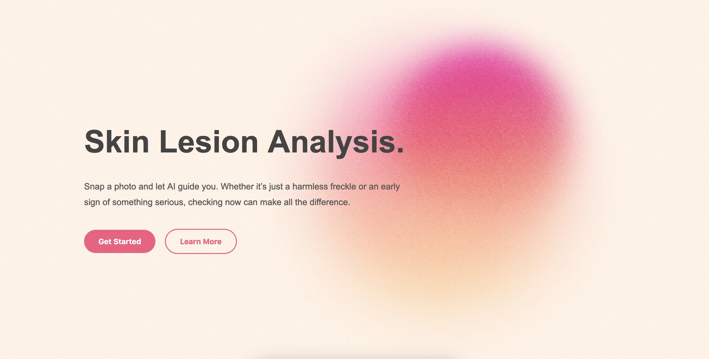

# Skin Lesion Analysis



## Table of Contents
1. [About](#about)
2. [Features](#features)
3. [Technologies Used](#technologies-used)
4. [Prerequisites](#prerequisites)
5. [Run](#steps-to-start-the-application)

---

## About
This repository contains a machine learning-powered web application designed to assist in identifying skin lesions. Thus, leveraging deep learning to classify images of skin lesions into different categories, providing users with an easily accessible tool for early detection.

## Features
- Upload an image of a skin lesion for analysis.
- AI-powered lesion classification into seven categories: `akiec`, `bcc`, `bkl`, `df`, `mel`, `nv`, and `vasc`.
- Intuitive and clean user interface for easy interaction.

## Technologies Used
- **Backend**: C#, ASP.NET
- **Middleware**: Python, Pytorch, Pandas, Sklean, Matplotlib, Transformers, FastAPI
- **Frontend**: React.js, CSS

### Prerequisites
Make sure you have Docker installed on your machine.

### Steps to Start the Application
1. Clone the repository:
   ```bash
   git clone https://github.com/<username>/skin-cancer-prediction-app.git
   cd skin-cancer-prediction-app
   ```

2. Docker:
   ```bash
   docker-compose up
   ```
3. Navigate to the specified port:
   ```bash
   http://localhost:3000
   ```
